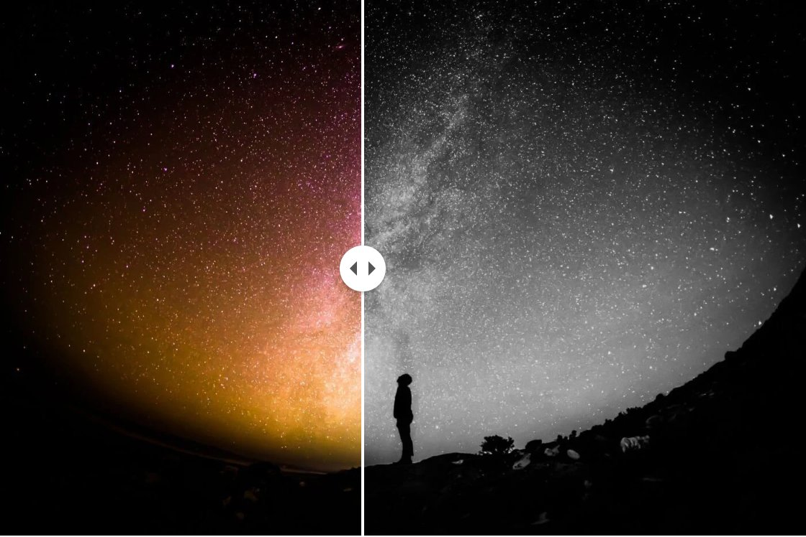

# Kirby Image Compare

A before/after image comparison block for [Kirby CMS](https://getkirby.com) —
two images, a draggable divider, done.



- **Zero dependencies, zero config.** ~60 lines of vanilla JS, no slider
  library. The frontend CSS/JS are injected into the `<head>` of every page
  that contains the block — nothing to add to your templates.
- **Responsive images** out of the box: WebP + JPEG `<picture>` with `srcset`,
  built on Kirby's own thumb engine.
- **Accessible:** the handle is a WAI-ARIA slider — mouse, touch, and full
  keyboard support (arrow keys, PageUp/PageDown, Home/End).
- **Themeable** through CSS custom properties.
- **Interactive Panel preview:** drag the divider right in the Panel to set
  the start position — the range field in the block drawer stays in sync.

## Requirements

- Kirby 5
- PHP 8.2+

## Installation

### Composer

```bash
composer require sigtrygg-space/kirby-image-compare
```

### Download

Download the latest release and copy the folder to `site/plugins/image-compare`.

### Git submodule

```bash
git submodule add https://github.com/sigtrygg-space/kirby-image-compare.git site/plugins/image-compare
```

## Usage

Allow the block type in any `blocks` field:

```yaml
fields:
  text:
    type: blocks
    fieldsets:
      - heading
      - text
      - image-compare
```

Editors then pick a before image, an after image, an optional caption, and the
initial divider position (0–100 %, default 50). The Panel preview mirrors the
frontend: drag its divider to set the start position, or fine-tune it with the
range field in the drawer (double-click the preview to open it).

The block renders a `<figure class="image-compare">` with both images as
responsive `<picture>` elements and a draggable divider. The stylesheet and
script are injected into the `<head>` automatically whenever a rendered page
contains the block — nothing to add to your templates. (Only if you render
blocks entirely outside of Kirby's page rendering — e.g. in a custom route
without a `<head>` — do you need to include the two files from
`kirby()->plugin('sigtrygg-space/kirby-image-compare')->asset('image-compare.css')->url()`
and `…->asset('image-compare.js')->url()` yourself.)

## Options

Configure site-wide in `site/config/config.php` under the
`sigtrygg-space.kirby-image-compare` namespace:

```php
'sigtrygg-space.kirby-image-compare' => [
	'widths'  => [480, 768, 1024, 1200, 1440],
	'quality' => ['webp' => 90, 'jpg' => 85],
	'sizes'   => '(min-width: 1200px) 720px, 100vw',
],
```

| Option | Default | Purpose |
| --- | --- | --- |
| `widths` | `[480, 768, 1024, 1200, 1440]` | `srcset` widths |
| `formats` | `['webp', 'jpg']` | `<source>` formats in order (`avif`, `webp`, `jpg`, `png`) |
| `quality` | `88` | thumb quality: int, per-format map, or `null` for your Kirby `thumbs` config |
| `sizes` | `(min-width: 1200px) 720px, 100vw` | `sizes` attribute (also overridable per call via the snippet variable) |
| `fallback` | `1200` | width of the plain `` fallback |
| `step` | `2` | keyboard step in percent (arrow keys; PageUp/PageDown move 10 %, Home/End jump to the edges) |
| `label` | `null` | overrides the handle's `aria-label` (useful on single-language sites, where the English translation would otherwise win) |

When setting `label`, use a noun naming what is controlled (e.g.
`'Bildvergleich'`) — screen readers announce the slider role themselves, so
don't repeat it in the label ("slider for …" would be read twice).

## Dynamically inserted blocks

The script initializes every `[data-image-compare]` stage once on page load.
If your site swaps content in later (htmx, Turbo, infinite scroll), re-run
the idempotent initializer on the new fragment:

```js
window.kirbyImageCompare.init(fragment); // argument optional, defaults to document
```

## Theming

Override these custom properties on `.image-compare` or any ancestor:

| Property | Default | Purpose |
| --- | --- | --- |
| `--image-compare-line-width` | `2px` | divider line width |
| `--image-compare-line-color` | `#fff` | divider line color |
| `--image-compare-handle-size` | `2rem` | diameter of the round grip |
| `--image-compare-handle-bg` | `#fff` | grip background |
| `--image-compare-handle-color` | `#555` | grip arrow color |
| `--image-compare-arrow-size` | `75%` | arrow size relative to the grip |

The stage's aspect ratio is derived from the before image automatically (the
plugin sets `--image-compare-ratio` as an inline style on the `figure`). To
force a different ratio, target the stage itself — a declaration on the stage
always beats the inherited inline value:

```css
.image-compare-stage {
	--image-compare-ratio: 16 / 9;
}
```


### Custom image markup

The responsive `<picture>` lives in its own snippet. To replace it (different
widths, formats, a lazy-loading library, …), copy
`snippets/image-compare-picture.php` to `site/snippets/image-compare-picture.php`
and adjust it — site snippets override plugin snippets of the same name. Your
markup's `picture`/`img` elements are sized by the plugin CSS regardless of
their classes. The same goes for the block markup itself
(`snippets/blocks/image-compare.php` → `site/snippets/blocks/image-compare.php`).

## Development

The Panel preview is a Vue single-file component, precompiled with
[kirbyup](https://github.com/johannschopplich/kirbyup):

```bash
npm install
npm run build   # rebuilds index.js/index.css from src/
```

The built `index.js`/`index.css` are committed; CI fails when they are stale.

## License

[MIT](LICENSE)
